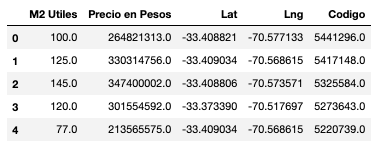
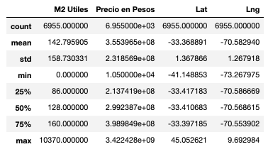
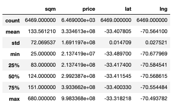
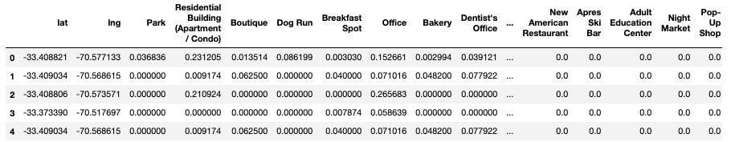

# Impact of Venues on Property Pricing - Report
*This is a report on how the venues nearby a property affect on its price.*

## Introduction/Business Problem

Today, there are many real estate companies in the world. These companies look for the best opportunities to invest. Within these opportunities, we find projects that involve huge investments. The problem is focused on Santiago de Chile, where there was a social crisis just before the COVID-19 crisis. Economy in Chile is not quite stable, this is why real estate companies have to make sure to invest only in the most promising projects.

Given this context, it's important for real estate companies to know how the surroundings of a property affect on its price. This way, they can know where their investment will have the highest pay off. Also, if they know how much the presence of each type of venue affects the price, they could reach a better decision on where to build.

To better understand how this approach can help these companies look at the following example. We have location A and location B, both with apparently similar conditions. The difference between these locations are that one has a supermarket and a school nearby, while the other has a park and a gym nearby. So, we could say that all four of these venues are a good thing to have close to our home (lets assume that). But we don't know in which of these locations to invest. If we had a model that quantifies the value that each type of venue adds to a property we could decide between these two locations rather easily (considering that the rest of the factors are pretty much the same).

On the other hand, this is very useful if there is a plan for new venues to be constructed near an evaluated location. So the price of the given location is not yet affected by these. If we knew how much value is going to be added by them, we can estimate the value of our unbuilt properties adding the effect of the upcoming venues. This is indeed very useful information for our stakeholders (real estate companies).


## Data

To accomplish the goal of learning the different impacts that a specific type of venue has on a property's price, the Foursquare API and a website that has a listing of many properties in Santiago de Chile from July 2019 to now (www.portalinmobiliario.cl) will be used. Scrapped data is already available in *.csv* format.

The *.csv* file has the following columns:

* **Tipo de Propiedad (string):** Wether the property is an apartment, storage, house, etc (all are apartments because of the downloaded info.)  
* **Tipo de Publicacion (string):** What kind of listing it is, rent or sale (here all are sale)  
* **Direccion (string):** Address of the listed property  
* **Numero de Piezas (float):** Number of bedrooms in listed property  
* **Numero de Banos(float):** Number of bathrooms in listed property  
* **M2 Utiles (float):** Useful square meters of property  
* **M2 Totales (float):** Total square meters of property  
* **Precio en Pesos (float):** Price in CLP  
* **Precio en UF (float):** Price in UF (unit that takes into account the devaluation of the CLP)  
* **Fecha de Publicacion (string):** Date of listing  
* **Fecha de Extraccion (string):** Date in which the information was extracted from the website  
* **Lat (float):** Latitude coordinate of property  
* **Lng (float):** Longitude coordinate of property  
* **Estacionamiento Incluido (bool):** If the property has parking then True, if not False  
* **Bodega (float):** Number of storage rooms offered with property    
* **Condicion (string):** If the property is new or used  
* **Codigo (int):** Unique code for every listing on website  
* **Url:** URL from where the info was scrapped

Example:

* **Tipo de Propiedad (string):** departamento  
* **Tipo de Publicacion (string):** venta  
* **Direccion (string):** Los Militares 5200, Las Condes, Nueva Las Condes, Las Condes  
* **Numero de Piezas (float):** 4.0  
* **Numero de Banos(float):** 3.0  
* **M2 Utiles (float):** 125.0  
* **M2 Totales (float):** 139.0  
* **Precio en Pesos (float):** 297568034.0  
* **Precio en UF (float):** 10450.0  
* **Fecha de Publicacion (string):** 2020-02-12  
* **Fecha de Extraccion (string):** 2020-03-02  
* **Lat (float):** -33.4073563  
* **Lng (float):** -70.5754166  
* **Estacionamiento Incluido (bool):** TRUE  
* **Bodega (float):** 1.0    
* **Condicion (string):** Usado  
* **Codigo (int):** 5422974
* **Url:** https://www.portalinmobiliario.com/venta/departamento/las-condes-metropolitana/5422974-los-militares-5200-las-condes-uda#position=7&type=item&tracking_id=1a728899-ef55-4246-b23c-cf02bea03fe8  

Regarding the Foursquare API, requests will be made in order to fill in the type of venues that each of these listed properties have around them. So, using the Foursquare's *search* endpoint with the *intent* parameter set to *browse*, all of the venues in the given radius will be retrieved.

This will return the following response fields:  

* **id:** A unique string identifier for this venue.  
* **name:** The best known name for this venue.  
* **location:** An object containing none, some, or all of address (street address), crossStreet, city, state, postalCode, country, lat, lng, and distance. All fields are strings, except for lat, lng, and distance. Distance is measured in meters. Some venues have their locations intentionally hidden for privacy reasons (such as private residences). If this is the case, the parameter isFuzzed will be set to true, and the lat/lng parameters will have reduced precision.  
* **categories:** An array, possibly empty, of categories that have been applied to this venue. One of the categories will have a primary field indicating that it is the primary category for the venue. For the complete category tree, see categories.  

Example response:

```json
{
  "meta": {
    "code": 200,
    "requestId": "5ac51d7e6a607143d811cecb"
  },
  "response": {
    "venues": [
      {
        "id": "5642aef9498e51025cf4a7a5",
        "name": "Mr. Purple",
        "location": {
          "address": "180 Orchard St",
          "crossStreet": "btwn Houston & Stanton St",
          "lat": 40.72173744277209,
          "lng": -73.98800687282996,
          "labeledLatLngs": [
            {
              "label": "display",
              "lat": 40.72173744277209,
              "lng": -73.98800687282996
            }
          ],
          "distance": 8,
          "postalCode": "10002",
          "cc": "US",
          "city": "New York",
          "state": "NY",
          "country": "United States",
          "formattedAddress": [
            "180 Orchard St (btwn Houston & Stanton St)",
            "New York, NY 10002",
            "United States"
          ]
        },
        "categories": [
          {
            "id": "4bf58dd8d48988d1d5941735",
            "name": "Hotel Bar",
            "pluralName": "Hotel Bars",
            "shortName": "Hotel Bar",
            "icon": {
              "prefix": "https://ss3.4sqi.net/img/categories_v2/travel/hotel_bar_",
              "suffix": ".png"
            },
            "primary": true
          }
        ],
        "venuePage": {
          "id": "150747252"
        }
      }
    ]
  }
}
```

Finally, the information given from the API will be merged to every property to which it belongs. In the end, the only field that will be used from the Foursquare response is the categories section. As for the *.csv* file, the price in CLP and the useful square meters will be used (to retrieve the price per square meter). Then a model can be trained to predict how much each property's square meter is worth, depending on which types of venues are around it. In a regression model, the coefficients would represent the influence of the proximity of each type of venue on the final price of a property.

## Methodology

### Data Analysis and Preprocessing

#### Property Listing Data

First of all, the dataset with the property listing had to be processed in order to get only the useful columns and discard misleading information. So, all columns in this DataFrame except for price, useful sqm and coordinates were dropped. With the resulting DataFrame looking like this:

<br>


Then, all the values that could have been duplicated must be dropped as well. In addition to this, the values that are NaN are as well useless information, so these rows were all deleted. Finally, the resulting DataFrame must be cleaned from outliers. For this task, the describe method was used, added to some knowledge about the data that had to be satisfied. Firstly the describe method looked like this:

<br>


Then, after applying the following filters, which were selected upon reasonable standards for apartments in the zone that had been scrapped:

1. Keep only apartments with more than 20 square meters
2. Keep only apartments with maximum 1500 sqm
3. Keep only price values lower than 1,000,000,000 (~1.300.000 US dollars)
4. Keep only price values higher than 20,000,000 (~26.000 US dollars)
5. Keep only lat values between -33.5 and -33.3 (Values for Las Condes, Santiago, Chile)
6. Keep only lng values between -70.7 and -70.4 (Values for Las Condes, Santiago, Chile)

Getting the following statistics for the new DataFrame:

<br>

There is a clear difference between the two tables. It can be easily noticed that outliers are dropped and that the new data is now consistent and closed. In total 414 rows were deleted and the following effect was observed:

* **sqm:** std from 159 to 72  
* **price:** std from 2.3e+08 to 1.7e+08  
* **lat:** std from 1.37 to 0.015
* **lng:** std from 1.27 to 0.028

Finally, the "sqm" column and the "price" column were combined to make a "sqm price" column that represents the price per square meter of the apartment.

#### Foursquare Complementary Data

The next step is to add to each of these columns a set of venues that are related to their respective coordinates. For this, the data was looped and for each of the rows in property listing data, a request for venues nearby was made to the foursquare API.

Here, a decision had to be made about how the information was going to be stored. So, in order to differentiate close venues with further apart venues, as well as possibly left out venues (too many venues and limit of 86 reached), the information was stored as one over the distance to a venue for each venue in the corresponding category.

For further understanding of the storing decision mentioned above, take the following example. If we have three venues in a radius of five hundred meters from a property that belong to the category of Medicine, these three will add to the Medicine column for this property's row. Let's say that the three properties are 230, 170 and 476 meters away from the given property. So these will add:

<p>
<b>cell_value = (1 &divide 230) + (1 &divide 170) + (1 &divide 476)</b>
</p>

The first DataFrame retrieved using foursquare API and coordinates from the properties_listing DF looked like this:

<br>

Here, the value for each coordinate was calculated using the formula described above. The next step is to narrow down the number of columns, as these are going to be the independent variables for the model that is going to be used. The first step here is to group all categories that are sub-categories of a bigger category. For example group all the restaurants in a Restaurant Category, all Gym activities in a Gym Category, etc. The result of this grouping is narrowing down from **569** categories to **239**.

Next, the number of occurrences for each of the remaining and grouped categories was calculated, in any case in which less than 500 properties had at least one venue in this category the respective category was dropped. This way the number of remaining categories (independent variables) dropped to 67. Finally, the remaining categories went through a process of selection, only the ones that delivered relevant information where kept. As some categories such as "Tech Start Up" or "Road" are not relevant and will only result in misleading information.

This left the DataFrame with only **26** columns as independent variables to insert in the model.

#### Model Selection

As the variables that are being handled are all continuous and the "predicted" value is also continuous, a linear regression is going to be used. Linear instead of polynomial to avoid over fitting. In this case if a polynomial regression was used, given that the dataset is only from a specific location, it is very likely for the model to assign too much importance to some venues that are only involved in some specific situations, losing generality.

Once the model is selected, the variables that are going to be evaluated are only the ones that have a 0.01 correlation at least. For this the correlation for each variable with the price per sqm was calculated and the columns with a smaller corr than 0.01 were dropped. Leaving the data with **27** variables.

Next, the relevance of each of the columns can be determined. For this the P-Value was used, by calling the library of statsmodel, which also has regression model (as sklearn) and can give back a summary with the P-Values corresponding to each independent variable. Using this the variables were narrowed down to only **13**.

At last, the model is run and tested. The values returned by the tests are not very high, but this doesn't matter too much, as the goal here is to determine an approximate value that is added or subtracted for a certain type of venue near to an apartment. The scores are as follows:

* **RMSE:** 632.253
* **R2:** 0.04

After this, the model is trained with the complete set of data and the three most positively influencing columns, as well as the three most negatively influencing columns are analyzed. These are the following columns:

<br>

<br>

## Results and Discussion

### Results Explained

We have gotten to the final results that the venues that are most relevant on the price of an apartment are Outdoors, Pharmacy, Metro Station, Medicine, Boutique and Hotel. Where we have positive and negative influences...

Positive:

* Medicine Category: 803.000 coef
* Boutique: 854.000 coef
* Hotel: 867.500 coef

Negative:

* Outdoors Category: -3.572.500 coef
* Pharmacy Category: -935.600 coef
* Metro Station: -707.200 coef

Now, what do these coefficients mean? Well, this is the amount that when divided to the distance of a venue from the evaluated property gice the difference in price that this venue on itself adds (or substracts).

So, let's say that a Medical Center will be addded 350 metres away from property A. So the estimated difference in price for A will be of 803.000 / 350, which is 2295. Then, let's say that property A has 100 sqm, this would mean that the value of property A would have been increased in 2295 x 100, which is 2.295.000 (more or less 4000 dollars).

### Making sense out of results

So, as we saw before, we now know the categories that affect the most. Now we must try and validate this information with some logical reasoning.

We will go one by one of each of the six categories mentioned before understanding why the values are correct.

* **Medicine Center**: Well, obviously being close to a medical center is a plus, it is very common for people to feel safer if they know that some kind of help can be found nearby. So, it makes sense that if a medical center is close, the value of an apartment increases.


* **Boutique**: This one is kind of tricky, because the presence of a boutique shop may also be a consequence of high class neighborhood. So, maybe a property does not change its value for the appearance of a boutique shop, but a neighborhood with boutique shops does have higher prices. This all driven by the fact that clients for boutique are high class people almost exclusively.


* **Hotel**: The presence of a Hotel is probably a good reference that the neighborhood has lots of venues nearby. So The meaning for the Hotel to be a positive influence in price may well be because of the fact that the Hotel brings many venues along with it.


* **Outdoors Category**: This one is pretty evident. If there are outdoors venues nearby that most likely means that there are not many other venues close. This is because in order to have an outdoor venue, there must be a big space (most likely), so if this is a place that is more in the outsides of the city, normally the prices for apartments drop.


* **Pharmacy Categories**: This category I don't really know why it could be a negative influence in price, this must be a coincidence that is subject of the reduced area that was taken into account by the data.


* **Metro Station**: Many would say (even I before this project) that having a metro station close by is a good thing for the price of an apartment. Well, this may be true in other places. But in the specific area of Santiago that was evaluated, the most valuable apartments are actually far away from metro stations, as the people that live there don't really use the public transportation system.

## Conclusion

To conclude, I believe that this model could be much more useful if it had used data from all over the world and maybe standarized better the big categories which would be measured. For example by investigating which categories are commonly relevant on apartment pricing, not only for some places, but for any place in the world. This way, we could have a more general model and we would maybe be able to even predict with some accuracy the price of an apartment in a certain neighborhood.

As a general result, I think that the results where good. Given that it was data from a place that I particularly know, I could give a reason to every coefficient calculated by the model. This is very helpful, as now we could probably submerge deeper into something like the just mentioned investigation.
